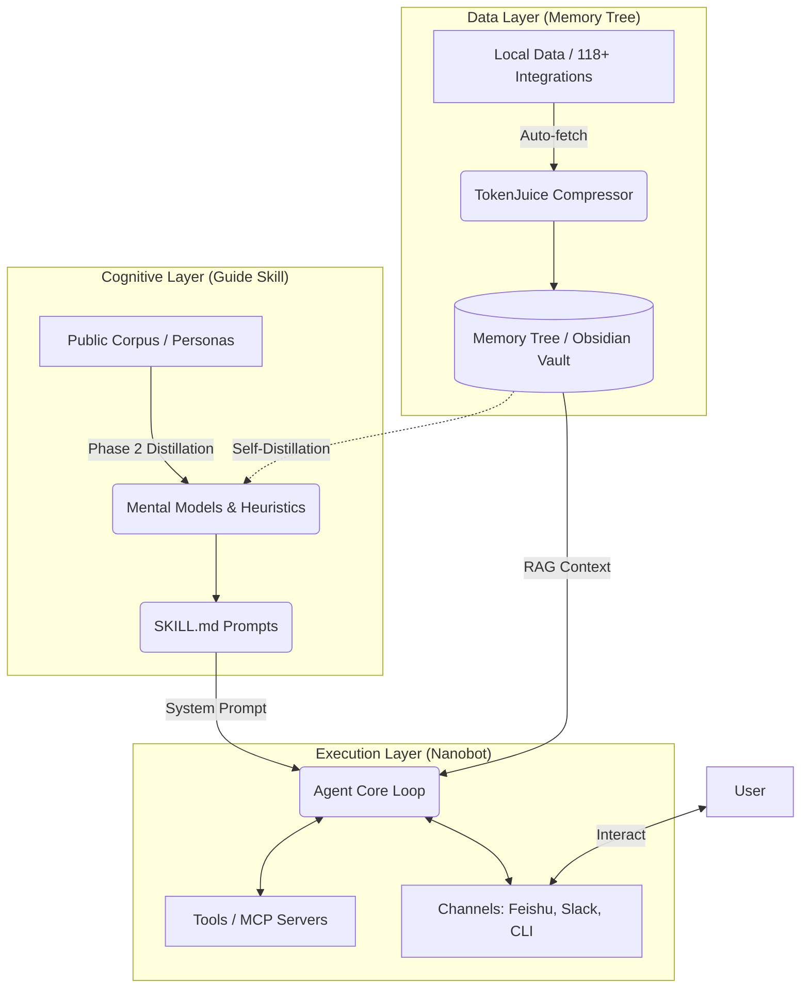

# Guide Cortex (Guide Cortex)：系统设计文档

## 1. 项目愿景与定位

**Guide Cortex** 是一个“自进化”的个人 AI 导师与执行系统。

它融合了以下三大生态的核心能力：
1. **认知深度 (Guide Skill)**：提供结构化的人物思维模型与决策框架。
2. **实时上下文 (Memory Tree)**：提供跨工具的个人数据同步、压缩与长期记忆。
3. **多端执行 (Nanobot)**：提供轻量级的 Agent 运行环、多渠道接入与 MCP 工具调用。

**核心痛点解决**：让 AI 从“泛泛而谈的聊天机器人”进化为“深刻理解你当前进度、具备顶级思维方式、且能直接操作你工作流”的数字分身。

---

## 2. 系统架构设计 (Architecture)

系统采用高度解耦的**三层架构**。

---

## 3. 功能模块设计 (Features)

### 3.1 神经记忆模块 (Synaptic Memory) - *基于 Memory Tree*
*   **持续注入 (Continuous Ingestion)**：后台静默运行，每 20 分钟同步 GitHub Commits、Notion 笔记、浏览器历史等。
*   **智能压缩 (TokenJuice)**：将繁杂的原始数据转化为高密度的 Markdown 摘要，大幅降低 LLM 调用的 Token 消耗。
*   **本地知识图谱**：以 Obsidian Vault 形式存储，用户可直接查看 AI 记住的所有内容。

### 3.2 认知引擎模块 (Cognitive Engine) - *基于 Guide Skill*
*   **多视角加载 (Multi-Perspective)**：支持动态热插拔不同的“导师视角”（如：今天加载 Paul Graham 看产品，明天加载 Linus 看代码）。
*   **自我蒸馏 (Self-Distillation)**：这是 Cortex 的创新点。定期扫描用户的 Memory Tree 记忆，蒸馏出**用户自身**的决策模型，指出知行不一的地方。

### 3.3 运动控制模块 (Motor System) - *基于 Nanobot*
*   **全渠道覆盖**：让这个拥有记忆和思维的导师可以驻留在飞书、微信、Discord 等聊天工具中，或作为桌面端运行。
*   **主动打断与提醒 (Cron Triggers)**：基于 Nanobot 的定时任务，AI 可以在特定条件触发时主动联系用户（例如：“发现你今天提交的代码没有写测试，这违背了我们设定的极客准则”）。
*   **工具调用 (MCP Integration)**：允许 AI 直接读取本地文件、执行 Git 命令、或者搜索网页，实现“知行合一”。

---

## 4. 核心逻辑设计 (Workflows)

### 4.1 会话响应逻辑 (The Chat Loop)
当用户在飞书中问：“我这个开源项目接下来该怎么做？”

1.  **触发阶段**：Nanobot 捕获用户消息。
2.  **上下文加载 (Context Retrieval)**：
    *   读取当前的 `SKILL.md` (例如加载了 Naval 视角)。
    *   查询 Memory Tree 记忆树，提取用户最近 7 天与该项目相关的所有提交和笔记摘要。
3.  **大模型推理 (Inference)**：
    *   组合 Prompt：`[Naval 的思维框架] + [用户过去7天的进度摘要] + [用户的问题]`。
4.  **工具规划 (Tool Use)**：LLM 决定是否需要调用 MCP 工具（比如查询一下 Github Trending 数据）。
5.  **输出阶段**：Nanobot 将极具针对性且符合 Naval 语气的回复发送回飞书。

### 4.2 记忆进化逻辑 (The Evolution Loop)
这是一个后台运行的异步任务：

1.  **数据沉淀**：用户的日常操作被 Memory Tree 记录。
2.  **周期触发**：Cron 设置每周末晚 11 点触发“复盘任务”。
3.  **蒸馏重构**：调用 Guide Skill 的抽象算法，对这一周的数据进行模式识别，找出用户最高频遇到的困境，甚至更新用户的“数字镜像”。
4.  **周报推送**：Nanobot 在周一早上发送一份基于特定视角的高质量复盘报告。

---

## 5. 项目演进路线 (Roadmap)

### Phase 1: 概念验证 (MVP - Linker)
*   **目标**：打通三方数据流。
*   **功能**：实现 Nanobot 能够读取 Guide Cortex 生成的 `SKILL.md` 作为 System Prompt，并且能在对话时挂载一小块 Memory Tree 的压缩文档作为上下文。
*   **成果**：一个能在 CLI 下对话，拥有特定名人性格，且知道你当前文件夹里有什么的聊天机器人。

### Phase 2: 执行层强化 (Agentic Actions)
*   **目标**：让 AI 能“动手”。
*   **功能**：深度集成 MCP。让加载了特定视角的 AI 能够根据其思维框架，自动执行代码审查 (Lint)、撰写符合风格的 README 等本地操作。
*   **成果**：一个带有明显个人风格的自动化代码助理。

### Phase 3: 记忆与认知的自进化 (Autonomous Evolution)
*   **目标**：实现真正的“数字分身”。
*   **功能**：引入 Guide Cortex 的自蒸馏机制。AI 不仅扮演名人，更能分析用户的 Memory Tree 数据，形成用户的“数字镜像”，并指出用户的思维盲区。
*   **成果**：首个具备自我纠错和长期进化的个人数字导师系统。
